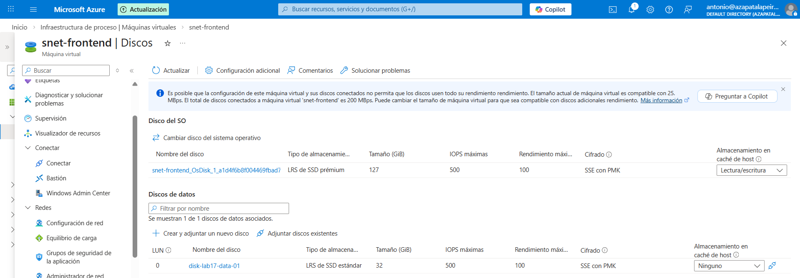
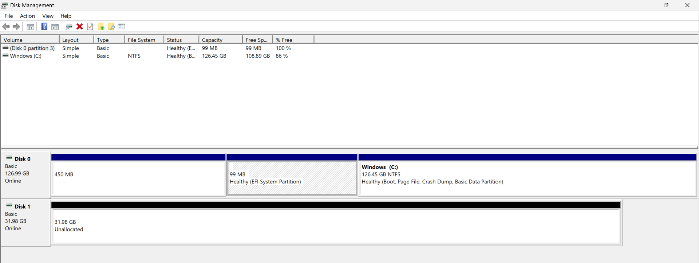

# Lab 17 - Gestión de almacenamiento en máquinas virtuales (Managed Disks)

## Objetivo
Separar el sistema operativo de los datos usando discos gestionados (Managed Disks). Esto facilita mantenimiento, recuperación ante fallos y migraciones, porque los datos pueden mantenerse aunque el disco del SO se rehaga o la VM se sustituya.

## Qué he hecho en este laboratorio
1. He creado un Managed Disk de datos.
2. Lo he adjuntado a una máquina virtual.
3. He inicializado el disco en el sistema operativo y lo he formateado.
4. He montado el volumen como una nueva unidad y he validado escritura.

## Configuración utilizada
- Disco de datos: `disk-lab17-data-01`
- Tipo: Managed Disk (Standard SSD)
- Tamaño: 32 GiB (aprox.)
- Inicialización: GPT
- Formato: NTFS
- Unidad: `F:` (DATA-LAB17)

## Evidencias

### 01 - Disco de datos visible y adjunto en Azure

Se muestra el disco de datos adjuntado a la VM desde el portal de Azure.

---

### 02 - Disco inicializado y volumen montado en el sistema operativo

Se muestra el disco ya inicializado (GPT), con el volumen creado y asignado a una letra de unidad.

## Checklist de verificación
- [x] El disco de datos aparece en Azure y está adjunto a la VM
- [x] El disco está inicializado y formateado
- [x] El volumen está montado como unidad y permite escritura

## Qué le diría a un cliente o en entrevista
“Separar datos del disco del sistema operativo reduce riesgos. Si el SO se corrompe o hay que recrear la VM, puedo mantener el disco de datos y re-adjuntarlo sin perder información.”
